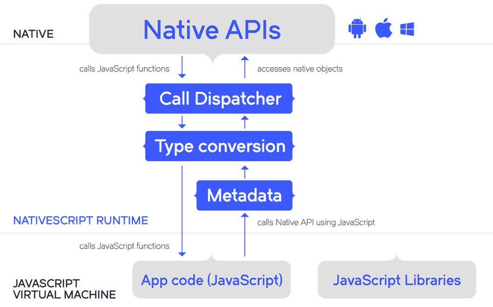

# What is NativeScript?

NativeScript is an OpenSource framework that allows you to build mobile apps with JavaScript.
Currently it has a full support for Android and iOS. As of 1.7 release (March 2016) it also includes "an early preview" support for Window Universal, which will cover both Windows Phone 10 and Windows 10.

At first sight this might seem very similar to Hybrid app development popularised by PhoneGap.
However NativeScript belongs to the JavaScript Native category of building mobile apps, where you use JavaScript to build apps with a 100% Native UI. This has a significant impact on the User Experience and Perfromance of the apps that you can build, with the outcome being almost identical to what you can achieve by building the same apps with a pure native code.

# Why NativeScript -> Benefits

* Skills reuse
  * Standards-based JavaScript, CSS, optionally TypeScript
* Code reuse
  * npm modules, 3rd-party iOS and Android libraries
* Easily use native APIs
  * No wrappers to access native APIs
  * Use native UI elements
* Open source!

# Abstraction Layer

With NativeScript you can build awesome apps without having to write a single line of platform specific code.
This can be achieved thanks to **tns-core-modules** (available from npm) an **Abstraction Layer** that contains platform specific implementation for each supported platfrom. It provides with modules that cover many different aspects of a mobile app from **UI abstraction**, through **Device Sensors** to **Hardaware Access** and many more.


Thanks to the **tns core modules** you no longer need to think on how to perform the same operation using 3 different Platform API’s, but instead you can concentrate on the what and not how. You can trust a NativeScript module to know how to call each of the Platform Specific APIs.


# Direct access to the native API – Platform specific code
You might wonder: how does {N} differ from other JavaScript Native frameworks like ReactNative and Appcelerator? The biggest differentiator is NativeScript's direct access to the Native API.

```javascript
var myAlert = new UIAlertView();
myAlert.message = "NativeScript rocks!";
myAlert.show();
```

# How does this work

{N} uses a pre-packaged JavaScript Virtual Machine. 
To be precise:
  * For **Android** it is – Google’s v8 JavaScript Engine,
  * For **iOS** and **Windows Universal** it is – WebKit’s JavaScriptCore


Just like with most modern web browsers a JavaScript Virtual Machine is a piece of software that interprets and runs JavaScript code.
And in our case it runs {N} code.

1. The **JS Virtual Machine** interprets and executes the JavaScript code.
2.  All calls to the Native API are delegated to the **Metadata** - a pre-built set of all available APIs on each platform. The Metadata is used to lookup each method/type signature.
3. Then the **Type Conversion Module** handles data conversion from JavaScript to Native types and in reverse from Native to JavaScript types.
4. Then finally, the **Call Dispatcher** makes an actual call to the Native API and takes care of passing down the results.



All of this means that you can access any function and any type available in each platforms API.


# Metadata Generating Process -> Day Zero support

We don’t have a bunch of people who build the API translations for each platform.
But instead we have the {N} Metadata generating processes – the way it works, if you point it at Android SDK it will build the representation of everything in there. All functions and types. And the same thing happens for iOS as well.

Metadata gets rebuilt every time you build the app. And to make it better, if you add a 3rd party Native plugin/library, the Metadata generating process will also include the additional metadata.

So because of that mechanism {N} provides Day Zero support. So when a new version of a platform comes out, all you have to do is rebuild your app against that version of the platform. For instance we already support Android M, which was announced at Google io. Without us having to make any changes to the bridge.

# NPM modules ???

# CSS

# Animations

# CLI -> Livesync, debugging

# IDEs -> Telerik Platform (with zero setup and companion app livesync), Visual Studio Code

# Performance – Native UI ???

# Other 
## Getting started pointers -> http://docs.nativescript.org/getting-started
## Angular 2.0
## OpenSource
